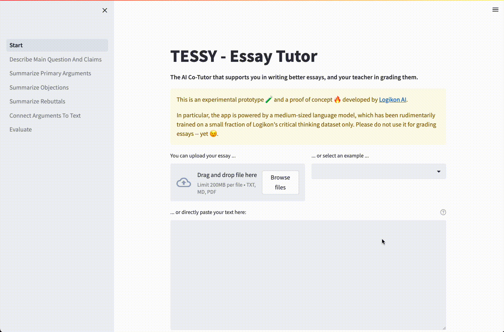
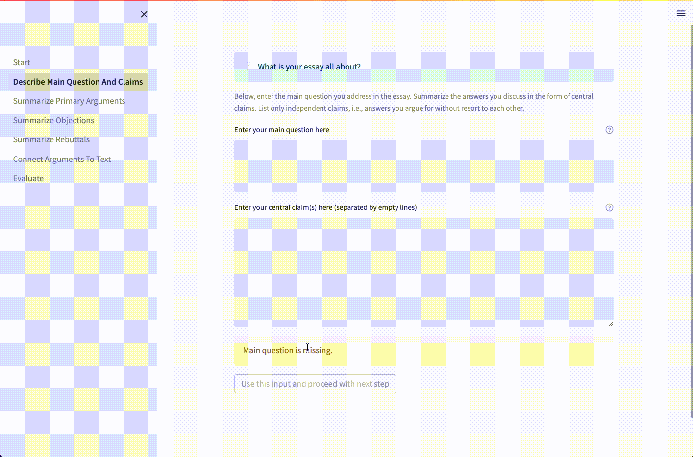
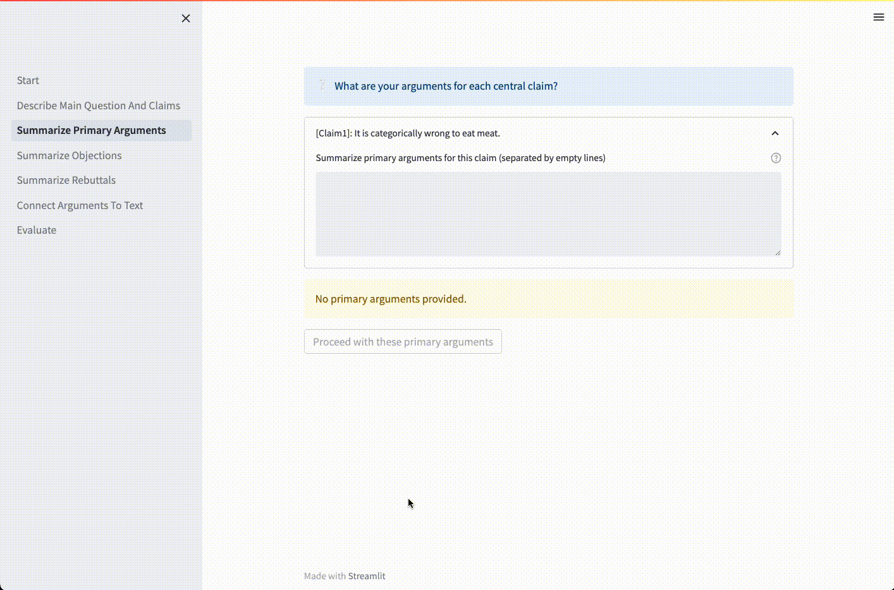

# TESSY Essay Tutor

**The AI Co-Tutor that supports students in writing better essays, and teachers in grading them.**

> This is an experimental prototype 🧪 and a proof of concept 🔥 developed by [Logikon AI](http://logikon.ai).
>
> In particular, the app is powered by a medium-sized language model,
which has been rudimentarily trained on a small fraction of Logikon's critical thinking dataset only.
Please do not use it for grading essays -- yet 😉.

Want to try out TESSY by yourself? Please drop a message [here](https://forms.gle/eJfuVqcdnzt4NRWi6).

## Quick Tour

### 1. Student uploads their essay

 

### 2. Student summarizes essay's central question and main claims

 

### 3. Student summarizes main arguments, objections, and rebuttals

 

### 4. Student connects summmarized arguments to their essay

 

### 5. AI evaluates argumentative outline of the essay and compiles assessment report

 

